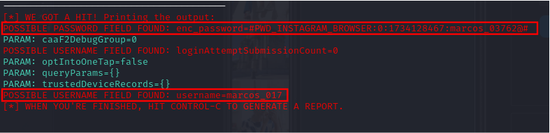

# Phishing para captura de senhas do Instagram

### !IMPORTANTE: Este conteúdo não é para promover ou fomentar esse tipo de prática, e sim apenas para estudo de umas das ferramentas do Kali Linux (o funcional de um phishing na prática).
### A prática das mesmas são considerados crime: "O crime de phishing é punido pela Lei 12.737/2012, pelo Código Penal e pela LGPD. A base legal para o phishing é o artigo 171 do Código Penal, bem como os artigos 154-A e 155 §4º II. (LEI conhecida como Carolina Dieckmann)"

### Ferramentas

- Kali Linux
- setoolkit

### Configurando o Phishing no Kali Linux

- Acesso root: ``` sudo su ```
- Iniciando o setoolkit: ``` setoolkit ```
- Tipo de ataque: ``` Social-Engineering Attacks ```
- Vetor de ataque: ``` Web Site Attack Vectors ```
- Método de ataque: ```Credential Harvester Attack Method ```
- Método de ataque: ``` Site Cloner ```
- Obtendo o endereço da máquina: ``` ifconfig ```
- URL para clone: http://www.facebook.com

### Resultados

### Página gerada, rodando no IP informado

")

### Credenciais usadas na página clone (elas devem ser capturadas no terminal do kali)


### Credenciais mostradas no terminal do kali (capturadas)


